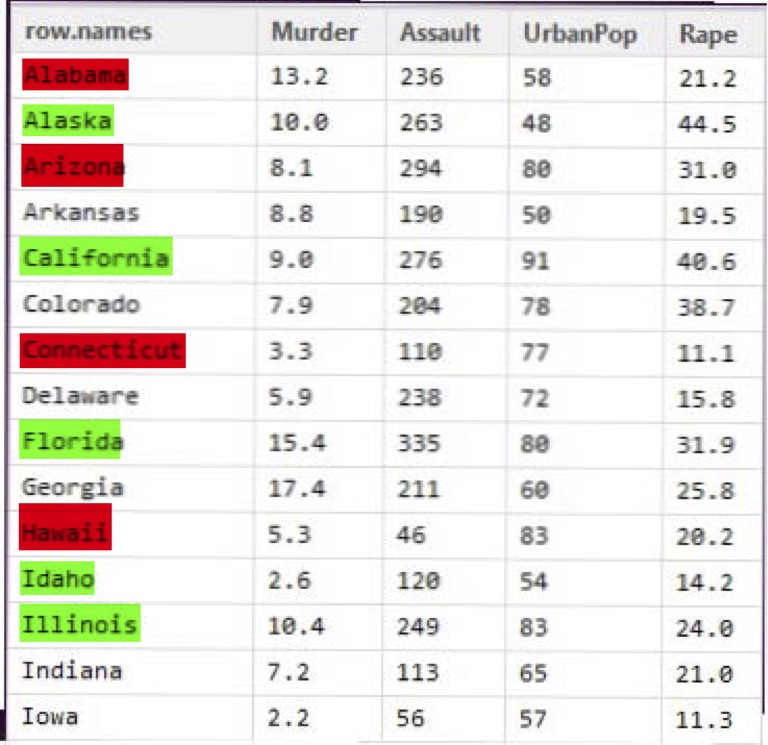
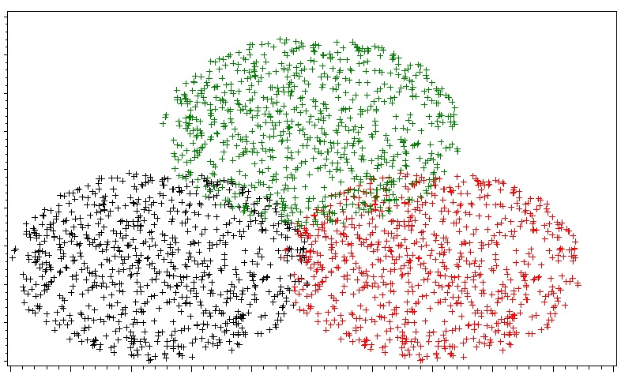

# Clustering

## Fundamentos 
###  Medidas de similaridad
\footnotesize

Los métodos matemáticos en la que descansan las técnicas de clustering están basados en la búsqueda de patrones de similaridad/disimilaridad en los datos. 

Dado un conjunto de valores de un dominio, las medidas de disimilariad son funciones que asignan valores reales a pares de instancias del dominio. 

Estas funciones se usan o bien en la formación del cluster (grupos iniciales) o el proceso de modelización del cluster (grupos evolucionan). Estos algoritmos se denominan algoritmos de clustering basados en similaridad o más bien disimilaridad. 

Las funciones de similaridad/disimilaridad miden y expresan numericamente el grado en el que dos instancias del mismo dominio (descritas por un conjunto de atributos) sin similares/disimilares unas de otras.

Se podrían clasisificar en:

- Basadas en diferencias: transforman y agregan de alguna forma las diferencias para cada dos instancias comparadas.
- Basadas en correlaciones: detectan patrones comunes de los valores inferiores y superiores de los atributos para cada dos instancias de valores.

### Disimilaridad basada en diferencias
\footnotesize

Dadas dos instancias $x_1,x_2$ con un conjunto de atributos $a_i$, estas medidas devuelven una matriz con la distancia existente entre cada par de atributos en cada una de las instancias.

Distancias a usar para calcular la matriz:

- Distancia euclidea: $d_{euc}=\mid \mid x-y \mid\mid_2$
- Distancia de Manhattan: $d_{euc}=\displaystyle \sum_{i=1}^n \mid (x_i-y_i)\mid$
- Distancia de Minkowski: 
- Distancia de Canberra
- Distancia de Chebysehv
- Distancia de Hamming

### Matriz de distancias

```{r,echo=TRUE,eval=FALSE}
library(cluster)
library(factoextra)
data("USArrests")
usa_arrests <- na.omit(USArrests)
dist_euc <- get_dist(usa_arrests)
fviz_dist(dist_euc)
```

La función **get_dist** por defecto calcula la distancia euclídea pero soporta otras funciones distancia. 

 

```{r,echo=FALSE,eval=TRUE}
library(cluster)
library(factoextra)
data("USArrests")
usa_arrests <- na.omit(USArrests)
dist_euc <- get_dist(usa_arrests)
fviz_dist(dist_euc)
dist_euc2 <- get_dist(usa_arrests,method = "manhattan")
fviz_dist(dist_euc2)

```


### Similaridad basada en correlaciones
\footnotesize

A veces debemos tener en cuenta que dos instancias son similares según el conocimiento del dominio más que en los valores de los atributos. 

Si atributos representan frecuencias de eventos, cuentas de frecuencias de palabras en textos. Las diferencias que importan más que cuantitativas son discretas: alto, bajo, etc.

Medidas:

- Correlación de Pearson
- Correlación de Spearman
- Similaridad del coseno

### Correlación de Pearson

- Establece el grado de relación entre dos atributos

- Normalmente es la usada


$$\displaystyle d_{cor}=1-\frac{\sum ( x_i - \bar{x} )( y_i - \bar{y} ) }{\sqrt{\sum ( x_i - \bar{x} )^2\sum ( y_i - \bar{y} )^2}} $$

##  Clustering en R
\footnotesize
Clustering es una técnica de aprendizaje no supervisado. 

Se introduce el número de grupos (clusters) a identificar. Algoritmo:

\begin{itemize}
\item Introducir número de clusters - $k$. 
\item Seleccionar $k$ centros iniciales para cada cluster.  El método más sencillo: selección aleatoria.
\item Resto de puntos del dataset se reparten inicialmente en $k$ grupos dependiendo de su proximidad a los $k$ centros iniciales.  
\item Actualización: Calculamos  $k$ nuevos centros a partir de los puntos que pertenecen a cada grupo provisional.  
\item Reasignación de datos a los $k$ grupos dependiendo de su proximidad a los nuevos $k$ centros.
\item Repetir hasta conseguir convergencia. 
 \end{itemize}
 
El algoritmo debe garantizar la convergencia.

### Centros
\footnotesize
 Clustering es muy sensible a la elección inicial de los centros. Y es un algoritmo muy exigente en recursos.

 Para calcular las distancias de puntos a centros se usa:

\begin{itemize}
\item  Distancia euclídea.
\item Otras distancias.
\item Medidas de similaridad.
\item Medidas probabilísticas.
\end{itemize}

Métodos de clustering

\begin{itemize}
\item  k-means
\item k-medoid o también llamado PAM (Partitioning Around Medoids).
\item fuzzy k-means
\end{itemize}
 
   
### Objetivo

\footnotesize
Dado un dataset  $D=\{x_1,x_2, \ldots,x_n\}$ donde  $x_i$ denota las filas y con $m$ atributos $A_i$ en las columnas tal que cada fila $x_i=\{a_1,a_2,\ldots,a_m\}$ con $a_k$ una valor del atributo $A_k$.
\begin{center}
 \includegraphics[scale=0.45]{figures/dataset1.png}  
 \end{center}
Los métodos de clustering agrupan la población del dataset (las filas) en $k$ grupos (clusters) con $k \leq n$.

###   k-means


 Características:
\begin{itemize}
\item La norma asume que los atributos están con igual escala.
\item No hay correlaciones entre los atributos. 
\item El número de clusters se da como parámetro.
\item La agrupación es descriptiva no se realiza físicamente en el dataset. 
\item Es un problema con complejidad N-hard.
\end{itemize}
 
Algoritmo: 

\begin{itemize}
\item Inicialización de las medias para cada cluster. 
\item Asignación de filas (población) a cada cluster que tengan la media más cercana a la seleccionada para cada cluster.  
\item Actualización: Calculamos  $k$ nuevas media de los cluster calculando lo que se denomina los centroides. 
\item Reasignación de filas a los cluster y repetir hasta conseguir convergencia. 
 \end{itemize}
Algoritmo debe garantizar la convergencia. 
 
 

```{r, fig.width=2, fig.height=5,echo=FALSE, out.width = "150px"}
library(knitr)


```

 
 El método  k-means agrupa el dataset en $k$ grupos distintos $S=\{S_1,\ldots,S_k\}$ minimizando la media interna de la suma de cuadrados.
 

 $$min_{S}\sum_{j=1}^k\sum_{x_j\in S_j}\mid\mid x_i -\overline{m_j}\mid\mid^2$$
 donde $\overline{m_j}$ es el vector media de los $m$ atributos promediado en todas las filas del cluster y $\mid\mid x_i -\overline{m_j}\mid\mid^2= \sum_{r=1}(x_r - m_r)^2$ (suma de las diferencias al cuadrado de los $m$ atributos - distancia euclidea entre los vectores de cada grupo y la media) 
 
## Número optimo de clusters 

###  Proyecto - dataset USArrests
 
<!-- para colocar una imagen -->
<!--  -->

```{r}
# Visualización de tablas desde Rmarkdown
#install.packages("kableExtra")
library(knitr)
library(kableExtra)
library(dplyr)
library(magrittr)
options(knitr.table.format = "html") 
```

 

We can compute k-means in R with the kmeans function. Here will group the data into two clusters (centers = 2). The kmeans function also has an nstart option that attempts multiple initial configurations and reports on the best one. For example, adding nstart = 25 will generate 25 initial configurations. This approach is often recommended.

  
  

```{r,echo=FALSE,eval=TRUE}
library(cluster)
library(factoextra)
data("USArrests")
usa_arrests <- na.omit(USArrests)
k2 <- kmeans(usa_arrests, centers = 2, nstart = 25)
str(k2)
```

  
We can also view our results by using fviz_cluster. This provides a nice illustration of the clusters. If there are more than two dimensions (variables) fviz_cluster will perform principal component analysis (PCA) and plot the data points according to the first two principal components that explain the majority of the variance.

```{r}
fviz_cluster(k2, data = usa_arrests)
```

Alternatively, you can use standard pairwise scatter plots to illustrate the clusters compared to the original variables.


```{r}
usa_arrests %>%
  as_tibble() %>%
  mutate(cluster = k2$cluster,
         state = row.names(USArrests)) %>%
  ggplot(aes(UrbanPop, Murder, color = factor(cluster), label = state)) +
  geom_text()
```

### Tamaño optimal de clusters

Una forma sencilla de estimar el número K óptimo de clusters cuando no se dispone de información adicional en la que basarse es aplicar el algoritmo para un rango de valores de K, identificando aquel a partir del cual la reducción en la suma total de varianza intra-cluster deja de ser sustancial (en las siguientes secciones se describen otras alternativas). La función
fviz_nbclust() automatiza este proceso. En este caso, dado que se sospecha de la presencia de outliers, se emplea la distancia de Manhattan como medida de similitud.

```{r}
library(cluster)
library(factoextra)
fviz_nbclust(x = usa_arrests, FUNcluster = pam, method = "wss",
diss = dist(usa_arrests, method = "manhattan"))
```

A partir de 4 clusters la reducción en la suma total de cuadrados internos parece estabilizarse, indicando que K = 4 es una buena opción.

## Clustering jerárquico 

### Proyecto dataset protein
  
```{r}
library(kableExtra)
options(knitr.table.format = "html") 

## ----eval=FALSE----------------------------------------------------------
## kmeans(x, centers, iter.max = 10, nstart = 1)
## #x:  numeric matrix of data, or an object that can be coerced to such a matrix (such as a numeric vector or a data frame with all numeric columns).
## 
## # centers: 	 either the number of clusters, say k, or a set of initial (distinct) cluster centres. If a number, a random set of (distinct) rows in x is chosen as the initial centres.
## 
## #iter.max:	 the maximum number of iterations allowed.
## # nstart:	 if centers is a number, how many random sets should be chosen?. Generate 10 initial random centroids and choose the best one for the algorithm.
## 
## # Ejemplo
## 
## grpMeat <- kmeans(dataset[,c("Atributo1","Atributo2","Atributo3")], centers=5, nstart=10)

## ------------------------------------------------------------------------
food <- read.csv('data/protein.csv')
head(food)
# 25 paises y 9 tipos de comida 
dim(food)
 

## ------------------------------------------------------------------------
my.foods <-food[,2:dim(food)[2]]
my.foods %>%
  kable("html") %>%
  kable_styling(bootstrap_options = c("striped", full_width = F))


## ------------------------------------------------------------------------
# medias de consumo de cada tipo de alimento
kable(sort(round(colMeans(my.foods, 1))),"html")

#desviación estándar 
kable(sort(round(apply(my.foods, 2, sd),1)),"html")


## ------------------------------------------------------------------------
 
set.seed(1)   ## to fix the random starting clusters
grpMeat <- kmeans(food[,c("WhiteMeat","RedMeat")], centers=3, nstart=10)
str(grpMeat)
grpMeat

## ------------------------------------------------------------------------
## lista ordenada de los grupos
Gr1=order(grpMeat$cluster)
# los índices que se usarán a continuación para ver los clusters
Gr1
# Visualizamos cada pais con su cluster de forma ordenada
data.frame(food$Country[Gr1],grpMeat$cluster[Gr1])


plot(food$Red, food$White, type="n", xlim=c(3,19), xlab="Red Meat",
       ylab="White Meat")

## ------------------------------------------------------------------------
plot(food$Red, food$White, type="n", xlim=c(3,19), xlab="Red Meat", ylab="White Meat")
text(x=food$Red, y=food$White, labels=food$Country,
       col=grpMeat$cluster+1)

## ------------------------------------------------------------------------
set.seed(1)
grpProtein <- kmeans(food[,-1], centers=7, nstart=10)
Gr1=order(grpProtein$cluster)
data.frame(food$Country[Gr1],grpProtein$cluster[Gr1])

## plotting cluster assignments on Red and White meat scatter plot
plot(food$Red, food$White, type="n", xlim=c(3,19), xlab="Red Meat", ylab="White Meat")
text(x=food$Red, y=food$White, labels=food$Country, col=grpProtein$cluster+1)


## ------------------------------------------------------------------------
#? dist
# This function computes and returns the distance matrix computed by using the specified distance measure to compute the distances between the rows of a data matrix.

distances.countries = dist(my.foods)
class(distances.countries)
kable(as.matrix(distances.countries),"html")
# Miramos lista de paises
kable(data.frame(id=seq(1:dim(food)[1]),country=food[,'Country']),"html")


## ------------------------------------------------------------------------
# Distancias entre los dos paises 
as.matrix(distances.countries)[5,19]
 
#  Calculñandolo manualmente
sqrt(sum((my.foods[5,]-my.foods[19,])**2))

## ------------------------------------------------------------------------
clusters = hclust(distances.countries, method="ward.D")

plot(clusters, main="Protein Dendrogram", labels=food[,1], cex=0.8, hang=-1)
rect.hclust(clusters, k=4)

## ------------------------------------------------------------------------
clusters$merge

## ------------------------------------------------------------------------
food$cluster = cutree(clusters, k=4)
head(food)
#tamaño de cada cluster
table(food$cluster)
# Diferenciar clusters según las medias
my.means = aggregate(cbind(RedMeat, WhiteMeat, Eggs, Milk, Fish,Cereals,Starch,Nuts,Fr.Veg)~cluster, food, mean)
my.means 

## ------------------------------------------------------------------------
par(mfrow=c(2,2))
eje_x = my.means[,1]
colors = c("lightblue" ,"red", "green", "pink")
barplot(my.means$RedMeat, main="Mean RedMeat by Cluster", names.arg=eje_x, xlab="Cluster", ylab="RedMeat", col=colors)
barplot(my.means$WhiteMeat, main="Mean WhiteMeat", names.arg=eje_x, xlab="Cluster", ylab="WhiteMeat", col=colors)
barplot(my.means$Eggs, main="Mean Eggs ", names.arg=eje_x, xlab="Cluster", ylab="Eggs", col=colors)
barplot(my.means$Milk, main="Mean Milk ", names.arg=eje_x, xlab="Cluster", ylab="Milk", col=colors)

## ------------------------------------------------------------------------
plot(my.foods[,2:5], col=colors)


## ------------------------------------------------------------------------
print(subset(my.foods, my.foods$cluster == 1))

print(subset(my.foods, my.foods$cluster == 2))
print(subset(my.foods, my.foods$cluster == 3))
print(subset(my.foods, my.foods$cluster == 4))


```
 
  